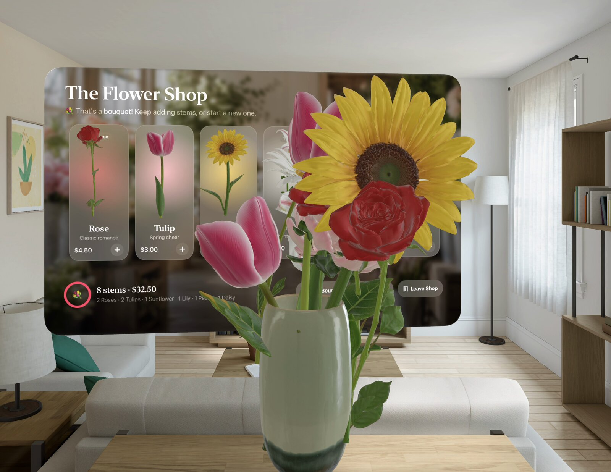
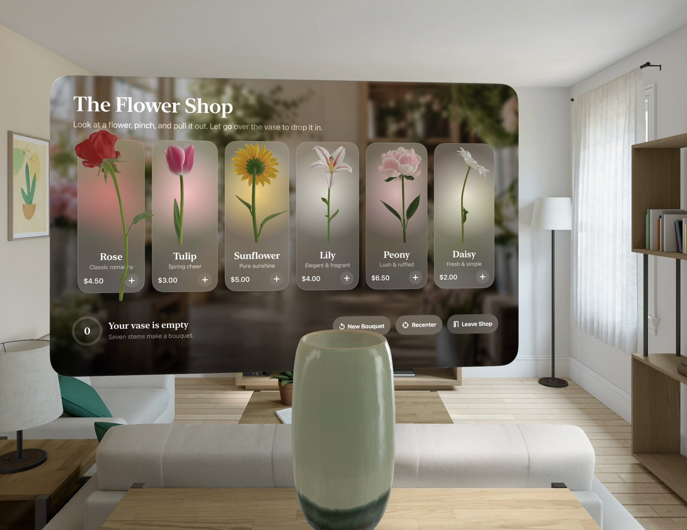
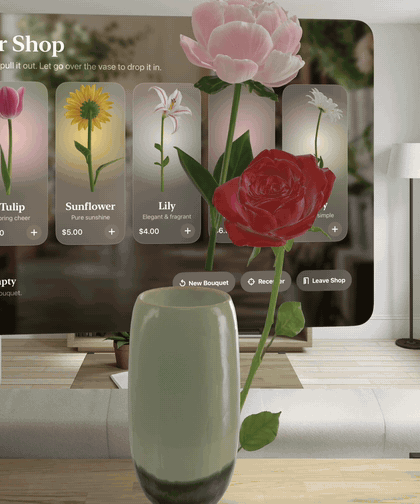
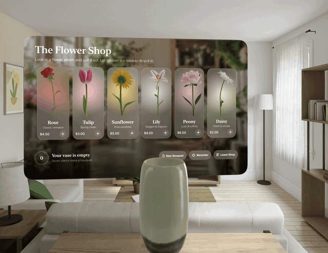
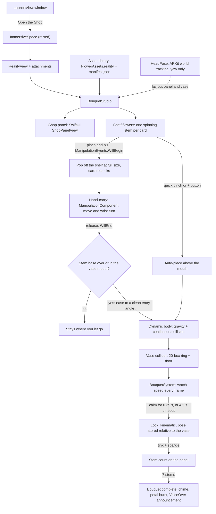
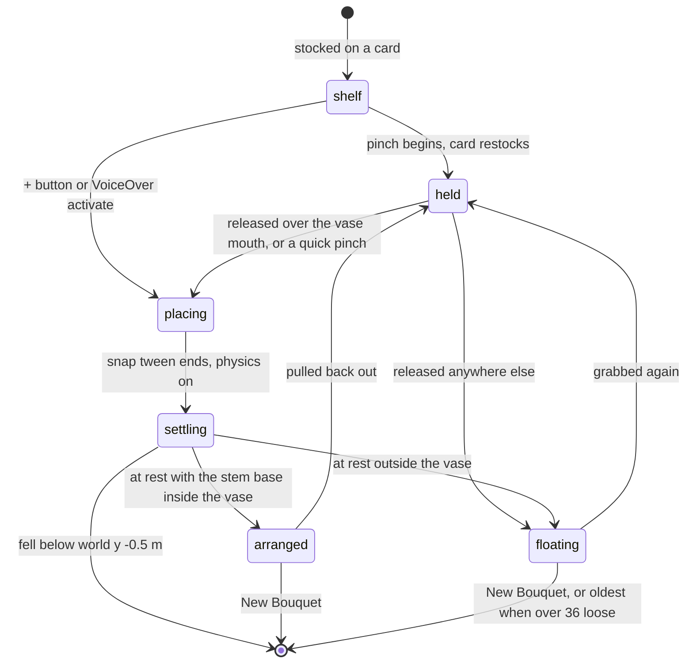

# Flower Shop: build a bouquet with your hands on Apple Vision Pro



*The visionOS 27 simulator, after a `-demoBouquet` run: eight stems dropped into the vase under physics, locked in
place, and the panel reads "That's a bouquet!". The 3D flowers, vase, shop backdrop and app icon are AI-generated
(see [Credits](#credits-and-licences)).*

Flower Shop is a small mixed-reality app for Apple Vision Pro. A flower-shop panel floats in front of you. You look
at a flower, pinch and pull, and a full-size stem pops out of the card into your hand. Carry it over to the vase and
let go. The stem slides in under real RealityKit physics, leans against the rim and the other stems, and once it stops
moving it locks into the arrangement with a soft ceramic "tink" and a sparkle. Seven stems make a bouquet. It's a
compact example of a few things that are fiddly on visionOS: system hand manipulation (`ManipulationComponent`),
a hollow vase collider stems can only enter through the mouth, a settle-then-lock state machine, and a SwiftUI panel
whose layout the 3D shelf reads so each flower hovers over its card. About 2,000 lines of Swift, with no
dependencies beyond Apple's frameworks.

## Demo

| The shop, before the first stem | Stems settling and locking in the vase |
|---|---|
|  |  |



*All captures: visionOS 27 simulator, Xcode 27, launched with `-autoOpenShop -vaseInFront -demoBouquet` (2026-10-05).
The simulator has no hands, so the demo uses the same "send it to the vase" path as the card's **+** button: each stem
flies to just above the vase mouth at a random lean and is then dropped and left to physics. Everything after the
drop (falling, colliding, settling, locking, the celebration) is the real simulation. Hand-carry needs a headset;
an on-device recording is planned.*

## How it works



Each stem's lifecycle is a `FlowerComponent.Phase` (`Studio/BouquetComponents.swift`), driven by manipulation events
in `BouquetStudio` and by the per-frame `BouquetSystem`:



- **Scenes**: a `LaunchView` window opens a mixed `ImmersiveSpace`. Everything is laid out relative to your head
  pose at launch (ARKit `WorldTrackingProvider`, yaw only so gravity stays down): the shop panel 1.35 m ahead, the
  vase low and to the right so a growing bouquet never hides the panel.
- **Shop panel**: a SwiftUI view (`ShopPanelView`) shown through the `RealityView` attachments closure. Its layout
  numbers (`PanelLayout`) are shared with the 3D shelf, so each spinning flower hovers in front of its card.
- **Grabbing**: RealityKit `ManipulationComponent` (visionOS 26) gives one-hand move with wrist rotation, two-hand
  rotate and hand-to-hand handoff. It uses `releaseBehavior = .stay` with scaling turned off.
  `ManipulationEvents.WillBegin` and `WillEnd` drive the state machine in `BouquetStudio`. A grab shorter than
  0.35 s that moves less than 3 cm counts as a tap and sends the stem to the vase for you.
- **Aiming**: when you let go, `insertionPose` works in vase space. If the stem points upward (axis y > 0.4) and its
  base is inside the vase or within 25 cm above the mouth, it is eased into a lean of at most ~28° that fits through
  the opening. Then it's dropped.
- **Physics**: each stem is a bloom sphere plus a stem capsule (35 g, high angular damping). The vase is a ring of
  20 thin boxes plus a floor, so stems can only enter through the mouth; a convex hull would fill the cavity.
  Continuous collision detection is on only while a stem is falling. An invisible 8 × 8 m floor catches misses.
- **Settle and lock**: `BouquetSystem` counts a stem as calm below 0.035 m/s and 0.7 rad/s. After 0.35 s calm (or
  4.5 s at most) it is frozen kinematic, and its pose relative to the vase is stored. Grab the vase and the whole
  arrangement comes with it; let go and the vase rights itself.
- **Geometry from measurements**: `FlowerShop/Resources/manifest.json` holds per-model measurements taken from the
  final USDZ meshes (bloom center and radius, stem axis and radius, vase rim height, inner radius, cavity floor).
  The colliders are built from these numbers, not from bounding boxes.
- **Assets**: the USDZs sit in a Reality Composer Pro-style `.rkassets` folder in a local Swift package
  (`Packages/FlowerAssets`). Xcode compiles them to `FlowerAssets.reality` at build time, so the device never parses
  USD. If a model is missing, `ProceduralModels` builds a stand-in and the panel shows a "Preview models" chip.
- **Animation and sound**: a small frame-driven tween system (`Studio/Tween.swift`) handles pop-out, restock,
  auto-placement, vase uprighting and recentering. The two sounds are synthesized in code
  (`tools/make_sounds.swift`) and played spatially from the vase.

## Measured in the simulator

Three runs of `-autoOpenShop -vaseInFront -demoBouquet` on 2026-10-05 (visionOS 27 simulator, same build). Each run
auto-places 8 stems with a random lean and heading, so outcomes vary:

| Run | Stems that stayed in the vase (of 8) | Bouquet celebration |
|---|---|---|
| 1 | 5 | no |
| 2 | 5 | no |
| 3 | 8 | yes (the run shown above) |

Counts are read from the panel's stem counter at the end of each run. Stems that don't stay in the vase end up out
of the simulator camera's view. Three runs show the spread; they aren't a benchmark. Why stems miss (bouncing off
the rim, or knocking each other out as the vase fills) hasn't been measured.

## Requirements

- A Mac with Apple Silicon and **Xcode 27** (visionOS 27 SDK). The deployment target is **visionOS 26.0**; nothing
  here needs visionOS 27.
- The visionOS simulator, or an Apple Vision Pro in Developer Mode for hand-carry.
- Optional: [XcodeGen](https://github.com/yonaskolb/XcodeGen) if you change `project.yml`.

## Run it

1. `open FlowerShop.xcodeproj` (or regenerate it with `xcodegen generate`; `project.yml` is the source of truth).
2. **Simulator**: pick an Apple Vision Pro simulator and run. No signing team is needed.
3. **Headset**: set your own team in *Signing & Capabilities* (the project ships with `DEVELOPMENT_TEAM` empty and
   the bundle ID `com.example.FlowerShop`; change the ID to one you own), or pass it on the command line:

   ```sh
   xcodebuild -project FlowerShop.xcodeproj -scheme FlowerShop \
     -destination 'platform=visionOS,name=<your Vision Pro>' DEVELOPMENT_TEAM=YOUR_TEAM_ID build
   ```
4. Tap **Open the Shop** in the launch window.

### Debug launch arguments

Set these in *Edit Scheme → Run → Arguments*, or pass them to `xcrun simctl launch`:

| Argument | Effect |
|---|---|
| `-autoOpenShop` | Skip the launch window and open the shop straight away |
| `-demoBouquet` | Auto-place eight stems, one every 1.1 s, to check physics without hands |
| `-vaseInFront` | Put the vase straight ahead so the simulator camera can see it |
| `-placeholders` | Use the procedural stand-in models |

To reproduce the captures above: `xcrun simctl launch booted com.example.FlowerShop -autoOpenShop -vaseInFront -demoBouquet`.

## How to play

| You do | What happens |
|---|---|
| Look at a flower on a card, pinch, pull toward you | A full-size stem pops out of the card into your hand; the card restocks |
| Keep pinching and move or turn your hand | The stem follows; turning your wrist turns it |
| Let go anywhere in the air | It stays exactly where you left it |
| Let go with the stem over or in the vase mouth | It's eased into a clean entry angle and falls in, colliding with the rim and other stems |
| Wait a moment | Once it stops moving it locks into the arrangement ("tink" + sparkle) |
| Quick pinch on a shelf flower, or the card's **+** | The stem flies itself into the vase |
| Grab the vase | Everything arranged in it comes along; let go and it rights itself |
| Grab a stem that's in the vase | Pulls it back out |
| 7 stems | "That's a bouquet!" chime and petal sparkles; keep going if you like |
| **New Bouquet** / **Recenter** / **Leave Shop** | Clear all stems / bring the shop back in front of you / exit |

Stems that miss the vase fall to the floor (an invisible collider at your real floor height) and can be picked up
again. Every shelf flower is also a VoiceOver button, so you can build a bouquet without pinching.

## Status and limitations

- Exercised in the visionOS 27 simulator (the captures above). This repo has no on-device recording yet, so
  hand-carry is described here but not shown.
- In the simulator the head pose comes back at the floor origin, so the layout falls back to a 1.45 m eye height.
  On device it uses your real head position.
- On the visionOS 27 simulator, `ViewAttachmentComponent(rootView:)` attachments stopped rendering once any entity had
  been loaded from a file. The `RealityView` attachments closure doesn't have this problem, so the panel uses it.
- Meshy's USDZ export declares `metersPerUnit = 0.3048` while the points are already in meters, so the models load
  about 3.3× too small in RealityKit. The bundled files were repackaged with `metersPerUnit = 1`, and the loader also
  normalizes height from the visual bounds.
- The **$** prices on the cards are decoration; there is no purchasing.

## Project layout

```
FlowerShop/
  App/         FlowerShopApp (scenes, component/system registration), AppModel
  Views/       LaunchView, ImmersiveView (RealityView), ShopPanelView, PanelLayout
  Studio/      BouquetStudio (layout, grabbing, aiming, physics, bouquet), BouquetSystem,
               BouquetComponents, Tween, HeadPose
  Assets/      AssetLibrary (load + normalize + manifest), FlowerCatalog, ProceduralModels
  Resources/   manifest.json, shop_background.jpg, Sounds/, Assets.xcassets (app icon)
Packages/FlowerAssets/   the .rkassets folder with the seven USDZ models
tools/make_sounds.swift  regenerates the two WAVs (byte-identical)
project.yml              XcodeGen spec
```

## Credits and licences

- **Code**: MIT, see [LICENSE](LICENSE).
- **3D models (AI-generated)**: the six flowers and the vase were generated with [Meshy](https://www.meshy.ai)
  (text-to-3D preview, then refine with 2K PBR textures and lighting removed, then remesh to about 12–20K triangles,
  or 9K for the vase). They were then repackaged for RealityKit: meters, Y-up, origin at the stem base or vase base,
  and the vase narrowed 20% so its mouth is about 11 cm across.
- **Shop backdrop and app-icon peony (AI-generated)**: Meshy text-to-image.
- Meshy-generated files: © Meshy, licensed under [CC BY 4.0](https://creativecommons.org/licenses/by/4.0/); modified
  (repackaged, vase narrowed 20%). They are not covered by the MIT licence.
- **Sounds**: `vase_tink.wav` and `bouquet_chime.wav` are synthesized from sine partials by
  `tools/make_sounds.swift` (MIT, like the code). No samples are used.
- The room in the screenshots is the visionOS simulator's built-in environment.
